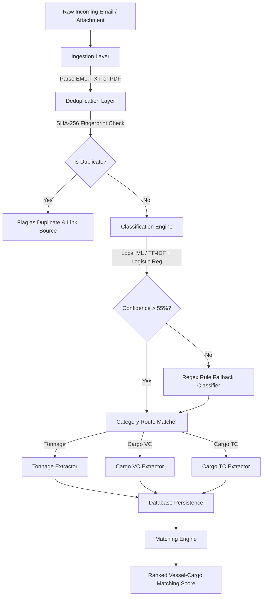

# ⚓ ShipSeg: Automated Shipping Email Segregation & Data Extraction System

ShipSeg is a modular, high-performance local pipeline built to ingest, classify, and extract commercial data from unstructured shipping broker emails and attachments. 

By automating the transition from messy emails to a structured database, the platform eliminates manual data entry, reduces vessel-to-cargo matching latency, and increases market visibility.

---

## 📋 The Business Problem
Maritime chartering desks and shipbrokers receive thousands of emails every day containing raw, unstandardized lists of **vessel availability (Tonnage)** and **cargo requirements (Voyage/Time Charters)**. Manually sorting these and typing them into a database leads to:
* **Missed Opportunities**: High-value matches go unnoticed in overloaded inboxes.
* **Operational Bottlenecks**: Significant latency in response time to broker offers.
* **Data Inaccuracy**: Human error in capturing critical values (laycan dates, draft sizes, ports).

---

## ⚡ System Constraints & Architecture
> [!IMPORTANT]
> **Zero Third-Party LLM Dependency Constraint**: To guarantee absolute data privacy, eliminate API subscription costs, and ensure instant offline latency, this system runs **entirely local machine learning models and heuristics**. It does **NOT** query OpenAI, Anthropic, or any external AI services.

### Technical Stack
* **Backend**: Python 3.9+ / Flask (REST APIs & static routing)
* **Local ML & NLP**: Scikit-Learn (TF-IDF Vectorization + Multinomial Logistic Regression)
* **Data Layer**: SQLAlchemy ORM / SQLite
* **Frontend**: Responsive Single Page Application (SPA) built using Vanilla JavaScript, HTML5, and a custom CSS premium dark-mode theme.

---

## 🔄 Pipeline Workflow



---

## 🛠️ Core Module Specifications

### 1. Ingestion & Normalization (`ingestion/`)
* **Multi-Format Support**: Parses raw email text paste blocks, standard `.eml` email files, `.txt` files, and `.pdf` attachments.
* **Fallback PDF Parser**: Attempts extraction via `pdfminer.six`. If missing locally, it falls back to a custom binary regex stream scanner to extract printable ASCII string chunks.

### 2. Smart Classification (`classification/`)
* Combines statistical Machine Learning with keyword rule heuristics:
  1. A **TF-IDF + Multinomial Logistic Regression** model trained on a localized dataset predicts the category.
  2. If the prediction confidence falls below the **0.55 threshold**, the classifier invokes a fallback regular expression scanner searching for shipping terms (`dwt`, `laycan`, `dely`, `tct`, `loading port`).
* Categorizes target records into three strict groups:
  * **Tonnage**: Open vessel availability details.
  * **Cargo VC**: Voyage Charter cargo requirements.
  * **Cargo TC**: Time Charter cargo requirements.

### 3. Case-Insensitive Data Extraction (`extraction/`)
Extracts custom fields depending on the assigned category:
* **Tonnage**: Vessel Name, Account Name, Open Port, Open Date, Vessel Type, Vessel Size, Flag, Built Year, Class, LOA, and Beam.
* **Cargo VC**: Cargo Name, Loading Port, Discharge Port, Laycan, Cargo Type, and Quantity.
* **Cargo TC**: Delivery Port, Redelivery Port, Duration, Laycan, Cargo Type, and Account.
* **Splitter Logic**: Automatically splits bulk emails containing multiple vessels or cargo listings (separated by `---` or `+++`) into individual database records.

### 4. Local Matching Engine (`routes/matching.py`)
Computes compatibility scores (scale `0–100`) between open vessels and charter requirements:
* **Port Proximity (Max 50 pts)**: Scored on exact string equivalence (50 pts), common token prefix matching (35 pts), partial containment (20 pts), or matching country codes (10 pts).
* **Laycan Overlap (Max 30 pts)**: Textual date parser extracts month/year combinations and grades month differences (0 month difference = 30 pts, 1 month = 20 pts).
* **Vessel Size vs Cargo Qty (Max 20 pts)**: Calculates the ratio between vessel DWT and cargo quantity (ratio between 0.6 and 1.6 = 20 pts).

### 5. SHA-256 Deduplication Layer (`routes/emails.py`)
* Strips all non-word symbols and spacing from the first 1000 characters of the body.
* Generates a unique SHA-256 hash representation.
* Compares incoming hashes against existing emails to mark and isolate broker forwards or circulars without halting processing.

### 6. Bidirectional Traceability & Verification (UX)
* **Email Split-Screen View**: The Inbox View presents a side-by-side verification interface showing the raw text next to the parsed records. Evaluators can confirm parser accuracy at a glance.
* **Source Trace-Backs**: Clicking the **✉ (View Source Email)** icon next to any vessel or cargo record opens the original context modal instantly.

---

## 🚦 Getting Started

To run the application smoothly on your local machine without high memory usage or compilation overhead, run the application directly through the pre-installed system Python.

### 1. Pre-population (Seeding)
Seed the database with sample real-world emails from Prime Maritime and other shipbrokers:
```bash
python3 seed.py
```

### 2. Running Automated Tests
Run the unit test suite covering classification, regex parser casings, matching weights, and deduplication:
```bash
python3 -m pytest tests/
```

### 3. Booting the Application
Start the Flask local development server:
```bash
PORT=8080 python3 app.py
```
Open **`http://127.0.0.1:8080`** in your web browser. *(Note: Do not open `index.html` as a file; always navigate through the served HTTP localhost address).*